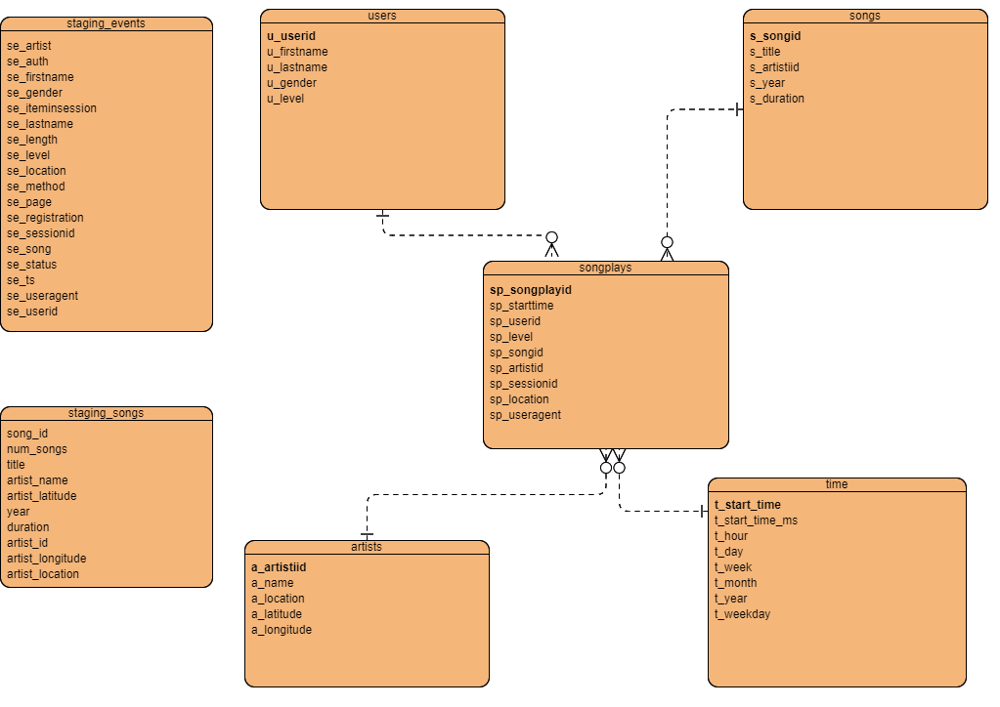

# Project Datawarehouse

## 1. Purpose of the database

A music streaming startup, Sparkify, has grown their user base and song database. At this point, they want to move their processes and data onto the cloud (aws). Their data resides in S3, in a directory of JSON logs on user activity on the app, as well as a directory with JSON metadata on the songs in their app.

In this project, we are responsible for building an ETL pipeline. Primary tasks of this ETL pipeline are as follows:
1. Extract data from S3
2. Stage data in Redshisft
3. Transform data and load into dimension and fact tables which are designed according to a star schema. 

The relational model on the cloud should help analytics team as they want to find insights into what songs their users are listening to.
 

## 2. Datasets

There are two types of source files that are available as JSON files on a S3 bucket:
- Log data: contains data about activity logs
- Song data: contains song data

## 3. Database Schema & ETL Pipeline

### 3.1. Database Schema Design

We have seven tables in total. 
- Two of them are designed for staging data from JSON files that are residing on a S3 bucket. 
- The remaining five tables are used for analytical purposes and designed as part of a star schema. 

#### 3.1.1. Staging tables
- staging_events: Staging table for log data which contains activity logs
    - sortkey on timestamp column (se_ts): As populating users table, sort operation is used frequently in order to get the latest data for a particular "user" object. 
- stagings_songs: Staging table for song data which contains metadata about a song and the artist of that song
    - sortkey on year column: As populating artists table, sort operation is used frequently in order to get the latest data for a particular artist object. 
    
    
#### 3.1.2. Star Schema Tables
__Fact Table__
- __songplays__: records in event data associated with song plays i.e. records with page NextSong
    
__Dimension Tables__
- __users__: users in music database
- __songs__: songs in music database
- __artists__: artists in music database
- __time__: timestamps of records in songplays broken down into specific units

ERD of the designed schema is as follows:

__Why Star Schema__
1. This database will cover analytical purposes. By using a star schema, available data can be queried, aggregated fast and accurate using simple SQL queries.
2. Star schema is a simple and clear structure which enables clear join paths between tables.

### 3.2. ETL Pipeline

ETL Pipeline covers the following steps: 
1. Extract log data from S3 and load them into database (table: staging_events)
2. Extract song data from  S3 and load them into database (table: staging_songs)
3. Extract songplay data using filter page=NextSong from staging tables (staging_events and staging_songs). Finally, load data into fact table (songplays).
4. Extract user data from staging_events and load into dimension table users. In case of detection of an overlap between two tables (based on userId columns), data for respective userId get updated in the dimension table. 
    - delete data from dimension table if staging_events contains data with a particular userId which is already in dimension table (users)
    - insert latest data for each userId into dimension table  
4. Extract song data from staging_songs and load into dimension table (songs)
    - exclude data (based on songId) which is already in the dimension table.(No update for existing record.)
5. Extract artist data from staging_songs and load into dimension table (artists) 
    - exclude data (based on artistId) which is already in the dimension table. 
    - to handle duplicates, insert latest data for each artistId (based on year) during initial load 
6. Extract time data from staging_events and load into dimension table.
    - exclude data which is already in the dimension table.(No update for existing record.)
    
    
## 4. Data Warehouse Setup

- Create a new IAM user in your AWS account
- Give it AdministratorAccess, From Attach existing policies directly Tab
- Register access key and secret into config file dwh.cfg
- Create an IAM role which enables that Redshift has readonly access to S3
- Create a VPC security group and specify inbound rules
- Create Redshift cluster and associate IAM role (S3 readonly access)
- Associate security group with Redshift cluster
- Register endpoint of Redshift cluster and IAM Role ARN into config file dwh.cfg

## 5. How to run 

1. Run create_tables.py to create database tables.
2. Run etl.py to load data into database.

## 6. Description of Files in the Repository

__1. sql_queries.py__
Python script containing all sql statements used in this project 

__2. create_tables.py__
Python script which creates/recreates tables in the database

__3. etl.py__
Python script which implements etl process: read JSON file on S3 Bucket, extracts data, load them into database.

__4. dwh.cfg__
Configuration file which contained access information 

## 7. Example Queries

1. amount of activity and amount of distinct users based on levels of users
~~~~sql 
select sp_level,
        count(*) as amount_activity,
        count(distinct sp_userid) amount_dist_users
from songplays
group by sp_level;

~~~~

2. give top 5 songs

~~~~sql
with t1 as (select sp_songid,
            s_title,count(*), 
            row_number() over (order by count(*) desc) rn 
            from songplays
            join songs on sp_songid = s_songid
            group by sp_songid,s_title )
            
            select * from t1 where rn<=5;
~~~~

3. give top 5 artists

~~~~sql
with t1 as (
select a_name, 
        count(*),
    row_number() over (order by count(*) desc) rn
from songplays 
join artists on sp_artistid = a_artistid
group by a_name )

select * from t1 where rn<=5
~~~~

4. five top songs for each week in year 2018

~~~~sql
 with t1 as (
  select t_week, 
         s_title,
         count(*),
         row_number() over ( partition by t_week order by count(*) desc) rn
  from songplays 
  join songs on sp_songid = s_songid
  join time on sp_starttime = t_start_time and t_year=2018
  group by t_week,s_title  )
  select * from t1 where rn=1 order by t_week;
~~~~

